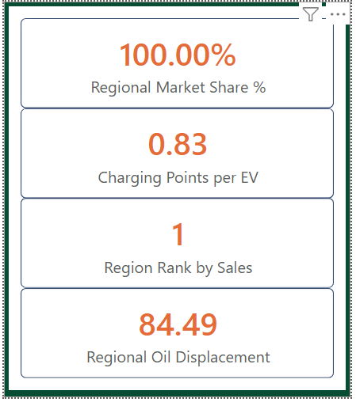

# ⚡ Global EV Market Analysis

## 📊 Overview
This project analyzes global electric vehicle adoption trends using an interactive Power BI dashboard. It provides insights into sales, regional growth, and market performance.

## 🚀 Features
- Multi-page interactive dashboard
- Region-based drillthrough analysis
- Tooltip-enabled detailed insights
- Trend analysis across different regions

## 🔍 Key Insights
- Identified rapid EV adoption in key regions
- Compared performance across countries
- Highlighted growth trends and market opportunities

## 🛠 Tools Used
- Power BI
- Microsoft Excel

## 🎬 Dashboard Preview (Home)

## 📷 Report Pages

## 🔎 Advanced Features

### Tooltip Page

### Drillthrough Analysis
